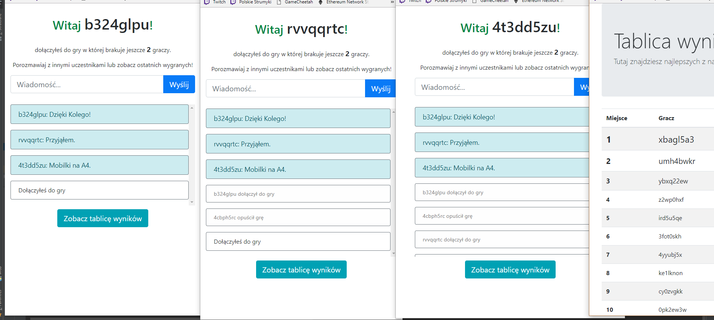
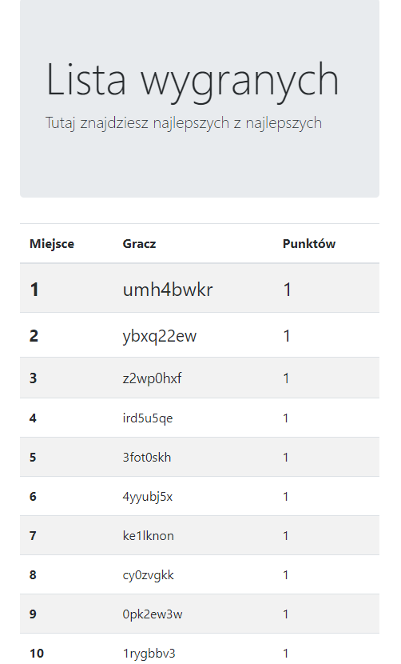
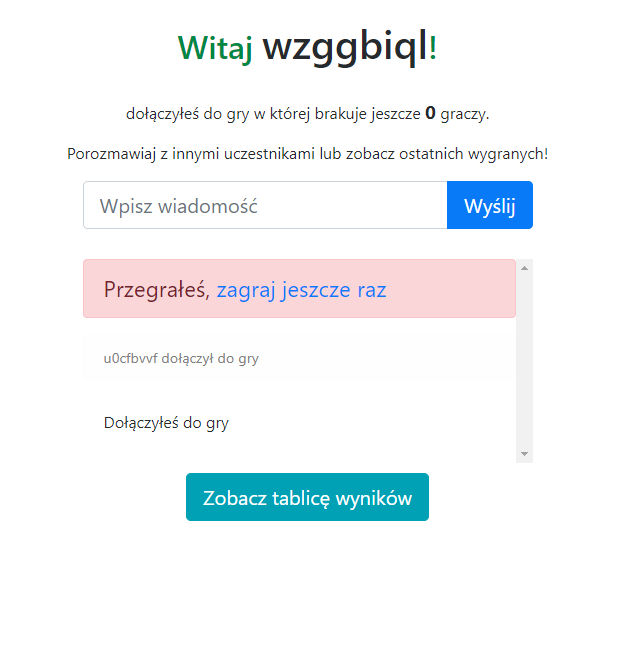
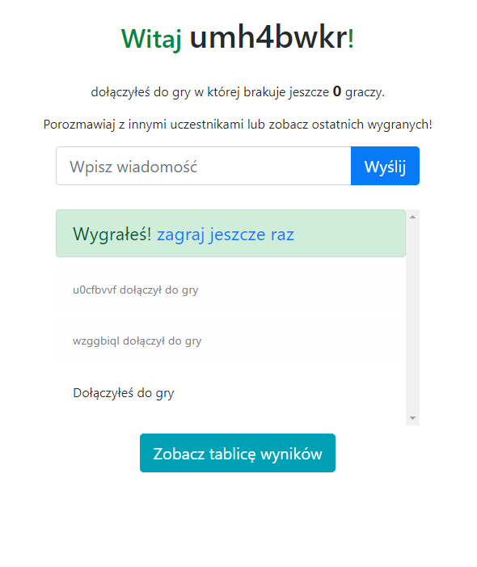

# theGame
Praca Dyplomowa

Tomasz Maj

# Wstęp
Coraz częściej duże firmy programistyczne opierają swoje usługi o środowiska rozproszone, gdzie jeden fizyczny serwer zaczyna mieścić w sobie wiele wirtualnych maszyn. W środowisku takim skalowalność nie jest problemem, wystarczy tylko wystartować kolejną kopię już uruchomionej usługi i przekierować na nią ruch sieciowy. Weźmy za przykład popularną platformę oferującą filmy na żądanie (VOD; Video On Demand) – Netflix – są oni pionierami rozwiązać opartych o architekturę mikroserwisów, czyli luźno powiązanych elementów, które dzielą ten sam kontekst. W tym przypadku celem jest dostarczenie strumienia wideo dla każdego użytkownika platformy, niezależnie czy korzysta z przeglądarki, smart tv czy aplikacji na tablecie.

Kluczowym elementem do konstruowania aplikacji w architekturze mikroserwisów jest Spring Boot, biblioteka dostarczająca rozwiązań znacznie ułatwiających tworzenie aplikacji rozproszonych.

Celem tej pracy jest przedstawienie elastycznego środowiska mikro usług, napisany w języku Java wersja 1.8, oparty o system zarządzania zależnościami Mave oraz framework Spring Boot.

